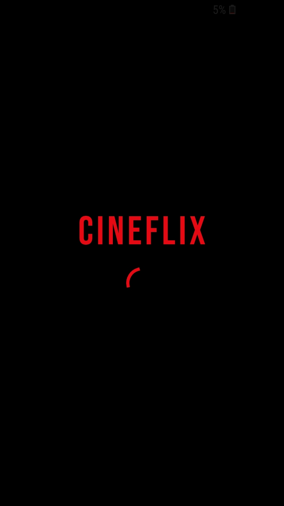
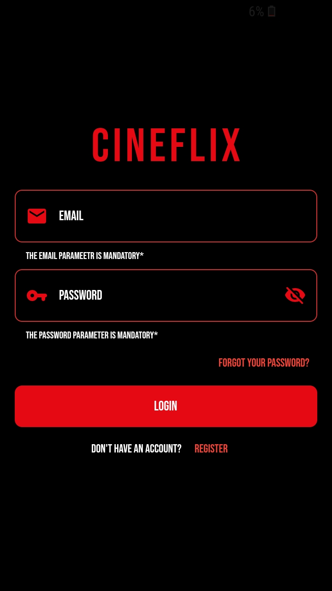
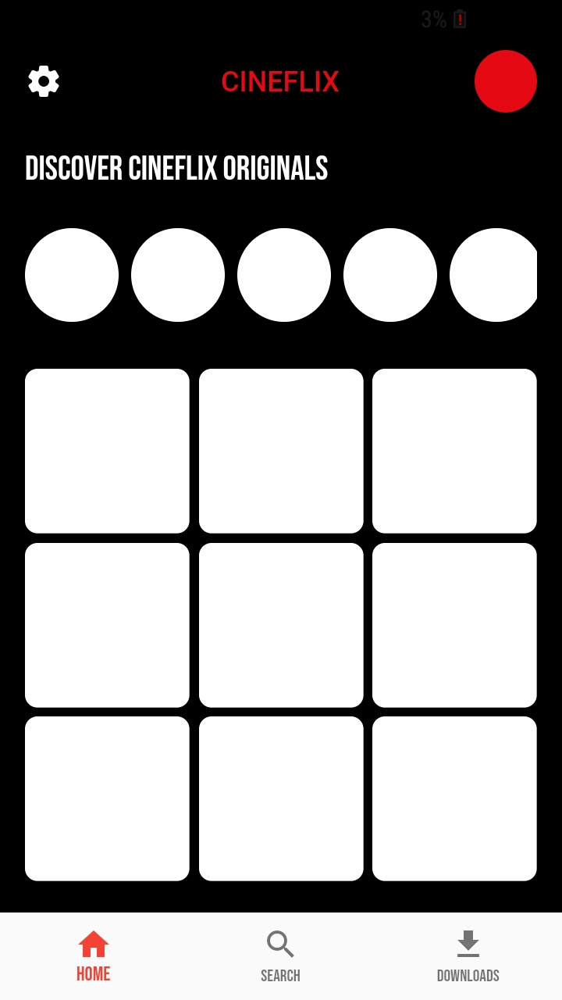
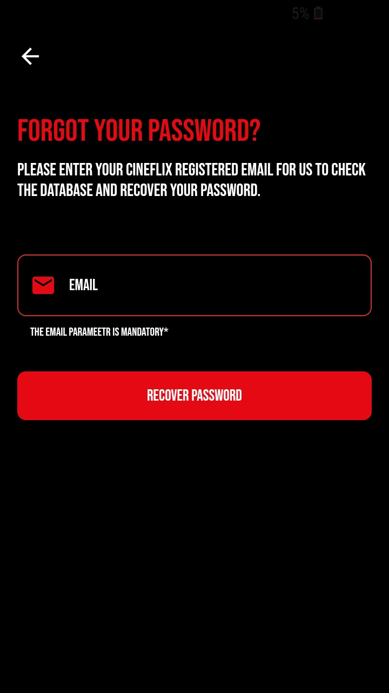
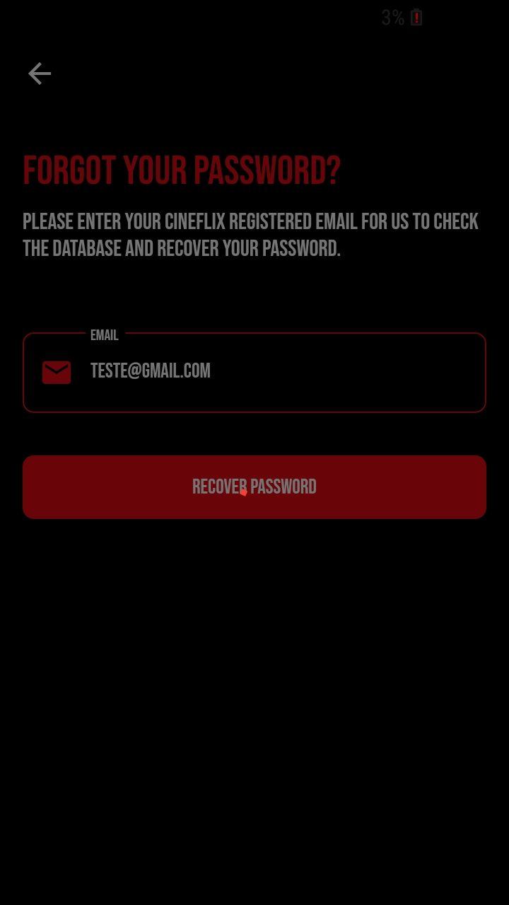
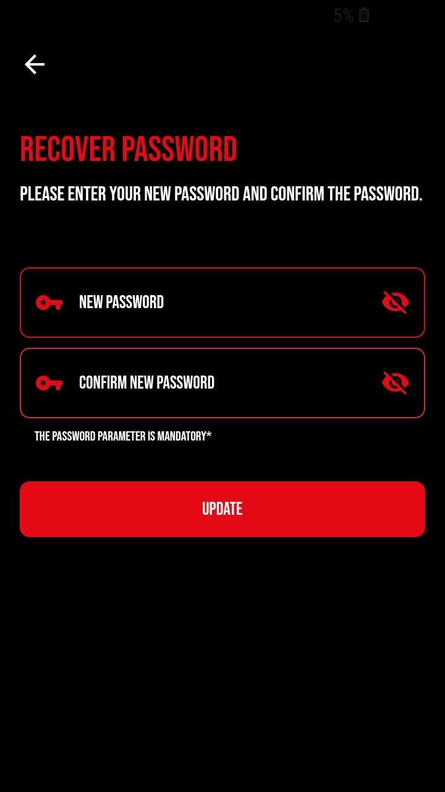
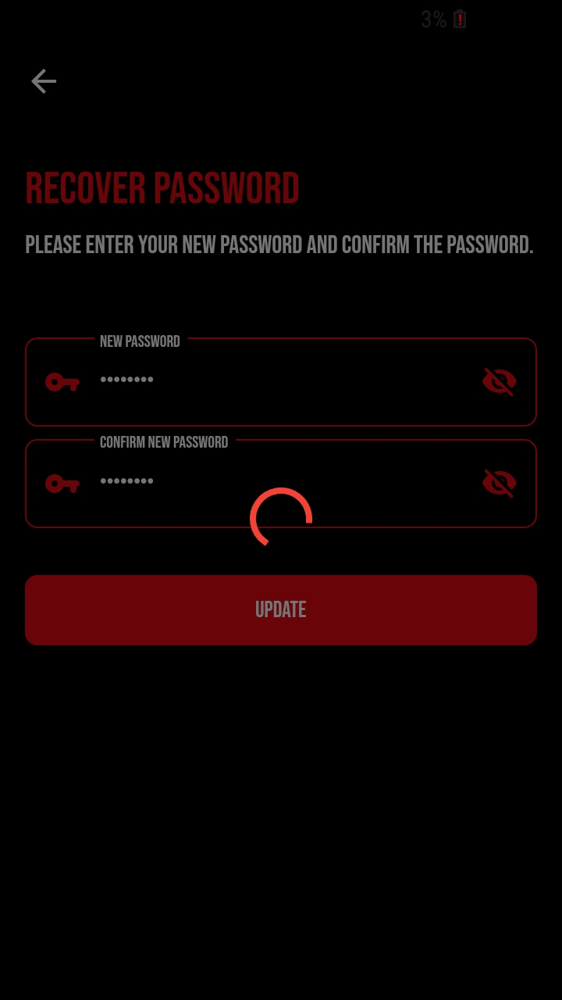

# #LevelUP3

O levelUP dessa semana consiste em criar um sistema de login!

## Features

- Login (tela)

- Criar conta(tela)

- Recuperar senha(tela)

- Validação de campos ( com textFormField e na lógica)

## Resultado

  
   
  

  
  
   s

  
   
  

## Pra Fazer

- Armazenar informações do usuário (Sharedpreferences, Sqflite)
- Home (Wireframe até o momento)

## Inpiração de Design

https://dribbble.com/shots/5832646-Login-Screens-UI-Kit-Freebie

## Packages Utilizados

- [google_fonts](https://pub.dev/packages/google_fonts)
- Font: Bebas Neue
